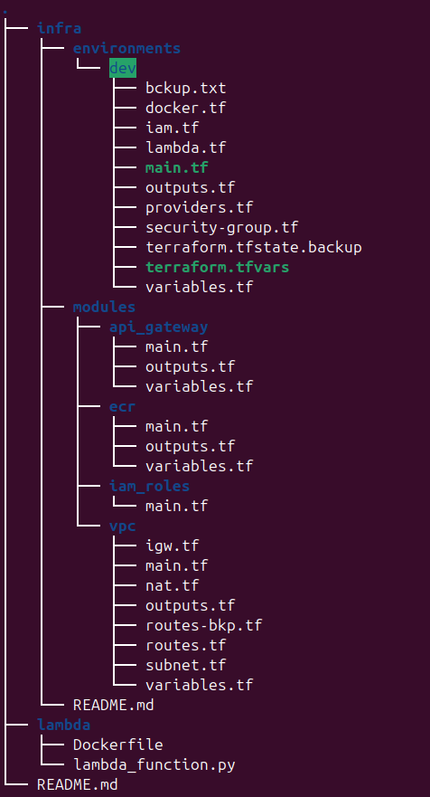
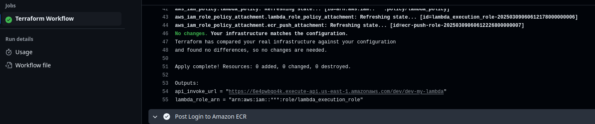
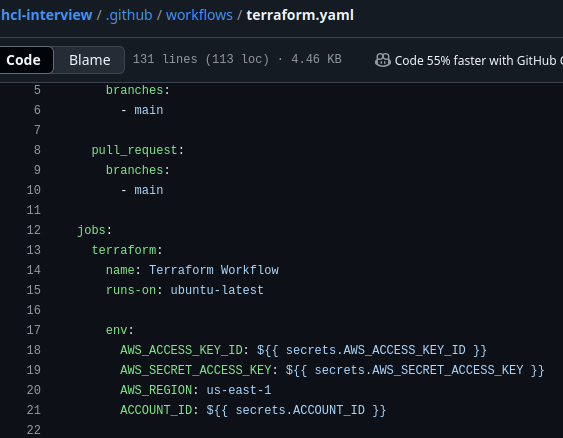
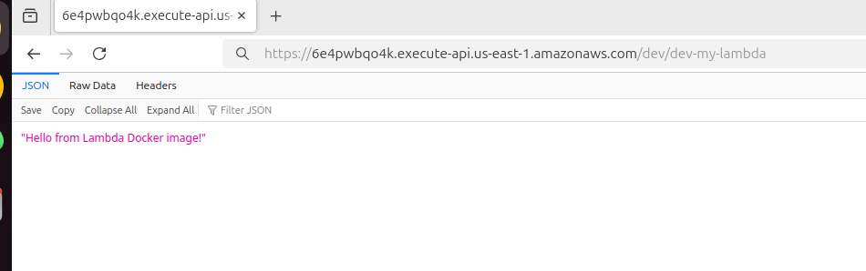

# INFRA File stracture

# Find the API GATE WAY INVOKE URL

# Create github action scretes with aws_access_key_id &aws_secret_access_key 

# Out put

# Also create a S3 backedn to only store terraform state not loc storing as a single user use case